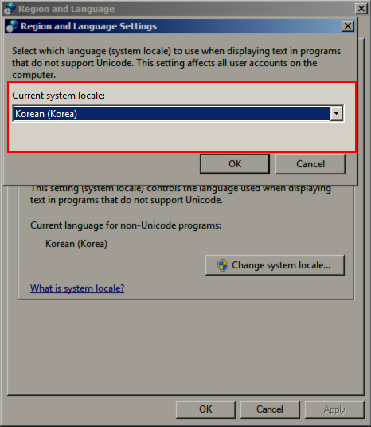
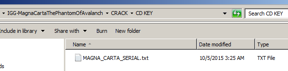
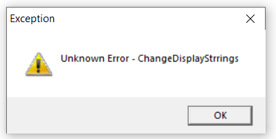

# Install Guide for "Magna Carta: The Phantom of Avalanche" #

Developed by Korean studio Softmax, the very first Magna Carta game, Magna Carta: The Phantom of Avalanche, was released exclusively for PC in South Korea.

A fan translation was created for English by [Talbain(Lakuuna), Sobodash, and Nejuf](https://github.com/Nejuf/magnacarta).

This guide explains how to install the Magna Carta: The Phantom of Avalanche with the English translations.

Want to check out the game's original site?  There's an archived version here: [web.archive.org](https://web.archive.org/web/20060702084649/http://pc.magnacarta.co.kr/en/main.php) 

## Game Download ##

Game download: [https://gamepciso.com/magna-carta-the-phantom-of-avalanche-download-free/](https://gamepciso.com/magna-carta-the-phantom-of-avalanche-download-free/)

Alternative direct download part 1: [https://docs.google.com/uc?id=0B2FlA4LAgnVvRGM1Tm5OY2NSUGc](https://docs.google.com/uc?id=0B2FlA4LAgnVvRGM1Tm5OY2NSUGc)

Alternative direct download part 2: [https://docs.google.com/uc?id=0B2FlA4LAgnVvYndjUi1xZmc0djQ](https://docs.google.com/uc?id=0B2FlA4LAgnVvYndjUi1xZmc0djQ)

### Unpacking/Extracting the Game ###

After downloading the two tarballs(compressed file packages), you'll need to extract them.  For that, the [7Zip Utility](https://www.7-zip.org/) is recommended.

After installing 7Zip, make sure both .tar files are in the same folder, then right click on the part1.tar file and choose to extract to a folder.

## Game Install ##

To run the game, you have to install it first.  Below are the official specs from the game's website.  I do not know if the game will work in Windows 8 or 10.  The game is Korean and the patch is old, so there is a small chance that installing it could mess up your system.  Install at your own risk!

### Specs ###

Operating System

- Windows 98/2000/ME/XP
- Windows 7 (confirmed and used for this guide)

Minimum Requirements

- CPU : Intel Pentium Celeron 466MHz
- Graphic card : Voodoo3, Riva TNT2 M64 (16MB) or above
- RAM : 64MB
- HDD : 3G or above
- CD-ROM : 8X above

Recommended Requirements

- CPU : Intel Pentium III 500MHz
- Graphic card : Geforce2 MX (32MB) or above
- RAM : 256MB
- HDD : 3G or above
- CD-ROM : 8X or above

### Steps ###

It is recommended that you keep a phone handy with Google Translate installed so that you can use its camera translation feature to translate the Korean Windows install messages.

#### Change Region/Locale ####

If you leave your Windows PC in the English locale, the Korean Windows install messages will be garbled and unintelligible.  If you set your region to Korea until you game installed, you'll be able to get usable messages that you can translate from Korean for help. (Google Translate camera feature works great)

#### Mounting the Discs  ####

The game comes in 4 CD discs but they're stored on your hard drive as .iso files.  To get Windows to treat the .iso files as CDs, you have to mount them virtually.  For that, the [WinCDEmu Utility](https://wincdemu.sysprogs.org/) is recommended.

With WinCDEmu installed, right click on each of the .iso files and choose "Select drive letter and mount".

In the mount options menu, you just leave it on the default options and hit "OK".

Repeat the process for all four disks (Install CD1,2,3 and Play CD4).  It's like your computer has four CD drives!

#### Running the Installer ####

Now that you have all the disks mounted, you can start the installer.  Do this by opening the first CD (MC_00) folder and running MCAR.exe.

In the launcher menu choose the first(top) option.

The installer will launch in fullscreen.

For the first code prompt, open the "CRACK/CD KEY/MAGNA_CARTA_SERIAL.txt" file and enter the first code.

In the second code prompt, enter the second code from the "CRACK/CD Key/MAGNA_CARTA_SERIAL.txt" file. Use ALL CAPS.

The 3rd code doesn't seem to be needed.

After the first CD installs, it'll prompt you to install the second disc.  Choose the second disk (MC_01) install it, and then choose the third disk (MC_02) and install it.

After installing the third disk, it will prompt you to install the Play Disc (MC_PLAY).  Do so and install it.

After the play disk install is finished, it will prompt you to install the first disk (MC_00) again.  Do so to complete the installation.

If you get a read-only file warning, choose yes to proceed.

#### Applying the Patch ####

You're almost there!  All that's left is to install the game patch and translation files.

**Important:** Prior to running the patch, make a backup of the "Drv" folder inside the game installation files (i.e. C:\Program Files (x86)\SOFTMAX\MagnaCarta\Drv).  Some users on newer PCs have reported missing graphics/textures if your computer is using the Direct 3D driver, and restoring this backup after applying the patch can fix it.
If you forget to backup the Drv files, you can reinstall the game or download them from here: [https://github.com/Nejuf/magnacarta/tree/master/Drv_unpatched](https://github.com/Nejuf/magnacarta/tree/master/Drv_unpatched)

In the "Patch" folder run the "MCV104a.exe" file.

After choosing "Setup" it will pause for a moment and then will start applying the patch and show a file copy window.  After it finishes, you should see the below window which states that the patch("update") was successfully completed!

## English Translation Download ##

The translation files installed by the patch utility may be outdated.  There's several types of language files: BGR (images), FPB (dialogue text), ITM (item/equipment text), SGI (weapon text), and ABI (skills text).

You can download the latest here:

- [English BGR](https://github.com/Nejuf/magnacarta/tree/master/bgr/en)
- [English FPB](https://github.com/Nejuf/magnacarta/tree/master/fpb/en)
- [English ITM](https://github.com/Nejuf/magnacarta/tree/master/itm/en)
- [English SGI](https://github.com/Nejuf/magnacarta/tree/master/sgi/en)
- [English ABI](https://github.com/Nejuf/magnacarta/tree/master/abi/en)

To download all of the translation files at once, you can use the "git clone" option or download as a [ZIP file](https://github.com/Nejuf/magnacarta/archive/refs/heads/master.zip).

## English Translation Install ##

Installation of the downloaded translation files is easy: just copy them into the appropriate game installation folders.

If you used the default installation options, then most likely your install folders will be:

- C:\Program Files (x86)\SOFTMAX\MagnaCarta\BGR
- C:\Program Files (x86)\SOFTMAX\MagnaCarta\Fpb
- C:\Program Files (x86)\SOFTMAX\MagnaCarta\Itm
- C:\Program Files (x86)\SOFTMAX\MagnaCarta\Sgi
- C:\Program Files (x86)\SOFTMAX\MagnaCarta\Abi

## Playing the Game ##

To start playing the game, all you have to do is **mount Play CD (MC_PLAY)** (the other disks do not need to be mounted), and go to your Windows installed programs and choose the below option.  The game should launch into fullscreen and start playing.

## Advanced Settings ##

If you encounter graphical or other issues with the game, you might want to try adjusting the game settings.  Mount CD 1 (MC_00), run it, and choose the second option to launch the settings.  The below screenshots show the settings options available.

## Troubleshooting ##

It's not unlikely that you will encounter some issue trying to install or play this game.  The game itself has enough bugs that it was recalled by its developer (SOFTMAX).  Combining the game bugs with the fact that it's been hacked for localization, and also that most of us are playing it on much newer hardware and OS, means there's a lot of opportunity for something to go wrong.  The game story is actually very good, so I hope you're willing to put up with the bugs and some grinding.

Known issues/errors will be captured below.  In general, here's some tips to avoid game bugs:

1. Don't wedge yourself into tight spaces where you might clip and get stuck
2. Don't cause the game to load things too quickly (like rapidly going back and forth between zones)
3. Try not to deviate from the game developer's intent (most QA testing is focused on actions/paths they anticipate the players will take)

### Game Saves ###

If you ever find yourself needing to reinstall the game or switching to another computer, then be sure to backup your games saves; it's very easy.

Just copy the "MC0#.sav" files from the game installation directory (C:\Program Files (x86)\SOFTMAX\MagnaCarta), and copy them back as needed.

### Error - Cannot Match Pixel Format ###

If you see the below error ("Cannot Match PixelFormat") when you try to launch the application:

Then the fix is to set the "Display Driver" to "Direct 3D" using the MC Setup (see [Advanced Settings](#advanced-settings) above) **AND** to set the Windows program compatibility mode for the executable ("C:\Program Files (x86)\SOFTMAX\MagnaCarta\MagnaCarta.exe") to "Windows XP (Service Pack 3)" like in the screenshot below.

### Error - Change Display Strings ###

If you see the below error ("ChangeDisplayStrrings") when you try to launch the application:

Then the fix is to set the "Display Driver" to "Direct 3D" using the MC Setup (see [Advanced Settings](#advanced-settings) above).

### Loading Glitch - Game Crashes or Errors When Starting/Loading the Game ###

If the game crashes or you see the below error ("abnormal program termination") when you try to load a save:

Then the fix is to restore the original DLLs (see [Applying the Patch](#applying-the-patch)).

### Graphic Glitch - Dark Rendering ###

If you see really dark or black 3D graphics rendering like below:

Then the fix is to restore the original DLLs (see [Applying the Patch](#applying-the-patch)).

### Game Bug - Schwartz Storm Headquarters Stairwell Trap ###

Just look at that stairwell!  Sitting their so ominously...  From the Schwartz Storm Headquarters Corridor, do not go into the door on the left and down into the stairwell early in the game.  If you go to the bottom of the stairwell, Calintz will walk backwards a bit and you will get completely stuck and have to reload.

